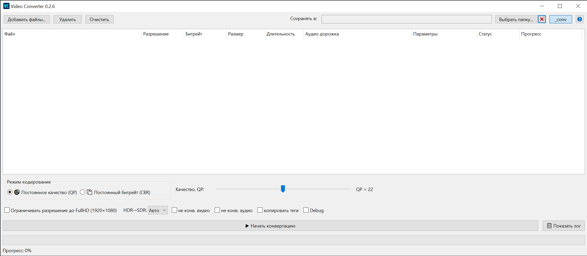

# Video Converter

**English** | [Русский](README.md)



## Overview

A simple Windows app for fast re-encoding of video files to MP4 using NVIDIA hardware acceleration (NVENC). Built on top of [FFmpeg](https://ffmpeg.org/).

The app is designed for batch work: a file list, shared encoding settings in the control panel and, when needed, per-row overrides. Everything required (`ffmpeg.exe`, `ffprobe.exe`, `mpv.exe`) ships with the app — nothing else has to be installed.

## Features

- **Batch conversion** of a file queue with both overall and per-row progress.
- **NVENC hardware encoding** (`h264_nvenc`, preset `p4`, profile `high`, `spatial_aq`). If NVENC is unavailable, the app falls back to the `libx264` software encoder — slower, same output format.
- **Two rate-control modes:** constant quality (QP/CRF, range 14–30) and constant bitrate (CBR).
- **Output size prediction** before the conversion starts — the "Expected size" column.
- **HDR → SDR tone mapping** (`zscale` + `tonemap=hable`) with Auto / On / Off.
- **Downscale to Full HD** (1920×1080), aspect ratio preserved.
- **Audio track selection** per file; re-encoded to AAC with a bitrate derived from the channel count (mono 128k, stereo 192k, 5.1 384k, 7.1 512k).
- **Subtitle muxing** into MP4 (`mov_text`), preserving track language and title.
- **"Don't convert" modes** for video and audio separately (stream copy, `-c:v copy` / `-c:a copy`).
- **Tag copying** from the source MP4 to the result (via `mutagen`).
- **Preview** of the source or converted file in the bundled mpv, using the selected audio track.
- **Drag & drop**, sortable columns, context menu, FFmpeg log with a Debug mode.
- **HiDPI support**, sound notification when the queue finishes.

Input formats: MKV, MP4, MOV, AVI. Output format: MP4 (H.264 + AAC).

## Installation

Download `Video_Converter <version> Setup.exe` from [Releases](https://github.com/Fan4Metal/video_converter/releases) and run it. The app installs into the user profile (`%APPDATA%\video_converter`) and does not require administrator rights.

Requirements: Windows 10/11 x64. For hardware acceleration — an NVIDIA GPU with NVENC support and a current driver; without one the app runs on the CPU.

## Usage

1. Add files with **"Добавить файлы..."** (Add files) or drop them onto the window.
2. Optionally pick a destination folder (**"Выбрать папку..."**). With no folder set, output files are written next to the sources. The path is remembered between runs.
3. The **`_conv`** toggle controls whether a suffix is appended to the output file name. If a file with that name already exists, a number is added.
4. Choose the rate-control mode and quality, tick the options you need.
5. Press **"▶ Начать конвертацию"** (Start). While running, the button turns into **"⏹ Отмена"** (Cancel).

> The user interface is in Russian only.

### Encoding settings

| Setting | Description |
| --- | --- |
| 🎯 Постоянное качество (QP) | The slider sets QP for NVENC (or CRF for libx264). Lower value — better quality, larger file. Sensible range: 18–28. |
| 📦 Постоянный битрейт (CBR) | The slider sets the video bitrate in Mbit/s. Use it when the output size has to be predictable. |
| Ограничивать разрешение до FullHD | Frames larger than 1920×1080 are scaled down, aspect ratio preserved. |
| HDR→SDR | "Авто" — tone mapping is enabled when ffprobe detects HDR (PQ/HLG); "Вкл"/"Выкл" force it on or off. |
| не конв. видео | The video stream is copied without re-encoding. |
| не конв. аудио | The audio stream is copied without re-encoding. |
| копировать теги | Copies tags from the source MP4 to the result. A global setting. |
| сохранить субтитры | Shows the subtitle column and muxes the checked text tracks into the MP4. |
| Debug | Prints raw FFmpeg output to the log. |

### Global and per-row settings

By default the control panel settings apply to every file — such rows are marked **⚙️Глобальные** in the "Параметры" (Settings) column.

Select one or more rows and change a setting, and it is stored for those rows only (the row gets highlighted and "Параметры" shows something like `QP=22, fullHD, TM=auto`). From the context menu these settings can be **applied to all other files** or **reset back to global**.

### List columns

`File` · `Resolution` · `Bitrate` · `Size` · `Expected size` · `Duration` · `Audio track` · `Subtitles` · `Settings` · `Status` · `Progress`

Click a header to sort, click again to reverse the direction. The subtitle column only appears when "сохранить субтитры" is enabled.

**Expected size** is computed up front: `≈` marks an exact calculation (CBR or stream copy), `~` a rough estimate for QP mode (a blend of a bits-per-pixel model and the source bitrate, calibrated against real NVENC encodes). During encoding the estimate is refined from live FFmpeg data, and when the job finishes the column shows the actual file size.

### Working with the list

- **Double click** — preview the file in mpv with the selected audio track.
- **Delete** — remove the selected rows.
- **Right click** — context menu: play the source or the converted file, apply settings to other files, reset conversion settings, open the source or output folder, remove from the list, clear the list.

## Building from source

The project uses [uv](https://docs.astral.sh/uv/) and requires Python 3.14+.

```bash
git clone https://github.com/Fan4Metal/video_converter
cd video_converter
uv sync            # app dependencies + the dev group (PyInstaller)
uv run main.py     # run from source
```

### External binaries

`ffmpeg.exe`, `ffprobe.exe` and `mpv.exe` are **not part of the repository** — download them separately and place them next to `main.py`:

- [FFmpeg for Windows](https://ffmpeg.org/download.html#build-windows) — `ffmpeg.exe` and `ffprobe.exe`;
- [mpv for Windows](https://mpv.io/installation/) — `mpv.exe`.

Without them the app won't start from source and `make_release.py` won't produce an installer: PyInstaller pulls these files into the build via `--add-data`, and from there they end up in the Inno Setup installer. `LICENSE`, `sound.wav` and the icons are bundled the same way.

The licenses of every bundled component are listed in the [LICENSE](LICENSE) file, which is shown by the installer and in the About dialog.

### Building a release

On top of the project dependencies you need [Inno Setup 6](https://jrsoftware.org/isdl.php) installed — it builds the installer. The script looks for the `ISCC.exe` compiler in the standard locations (`C:\Program Files (x86)\Inno Setup 6` and `C:\Program Files\Inno Setup 6`) and falls back to calling it through `PATH`.

```bash
uv run make_release.py
```

The script reads the version from `__VERSION__` in `main.py`, builds `dist\VC` in `--onedir` mode with PyInstaller, copies the wxPython Russian locale, writes the version into `setup.iss` and invokes `ISCC.exe`. The resulting installer lands in `dist`.

If you don't need the build tools, install without them:

```bash
uv sync --no-dev
```

## Technical details

- Video: `h264_nvenc` (VBR with `-cq` for QP, or `-b:v`/`-maxrate`/`-bufsize` for CBR), falling back to `libx264` (`-crf` / CBR, preset `medium`).
- Output pixel format is `yuv420p`; tone mapping uses the chain `zscale=t=linear:npl=30 → tonemap=hable:param=1.5 → zscale=t=bt709:m=bt709`.
- Audio: `aac` with the source track's channel count and the bitrate from the table above.
- Container metadata (`-map_metadata -1`) and embedded EIA-608/CEA-608 closed captions (`-bsf:v filter_units=remove_types=6`) are stripped from the output.
- File information is collected with a single `ffprobe` call when a file is added, then cached.
- The destination folder path is stored in the registry under `HKEY_CURRENT_USER\SOFTWARE\video_converter`.

## License

[MIT](LICENSE)

FFmpeg (LGPL 2.1) and mpv (GPL 2) ship with the released build but are not part of the repository, and are distributed under their own licenses. Their notices, together with the attribution for the notification sound, are in the [LICENSE](LICENSE) file.
